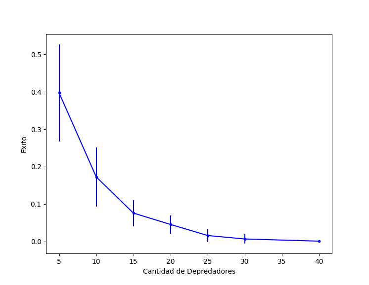
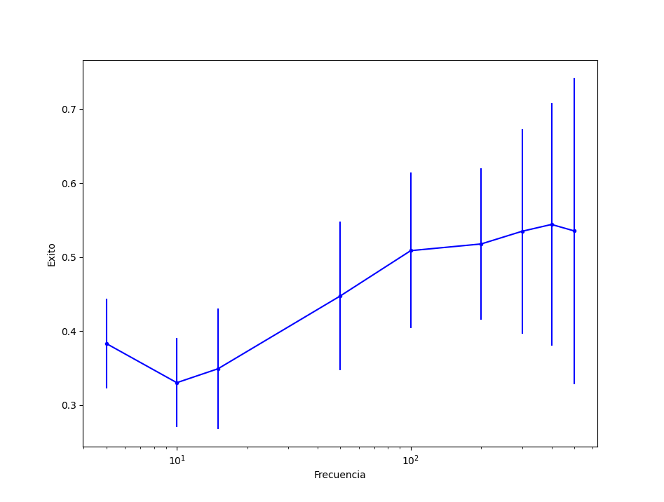
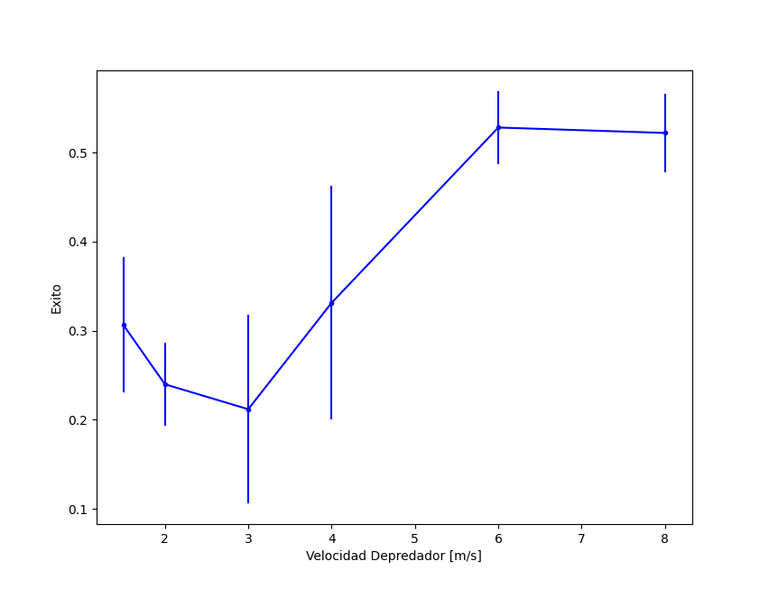

# Predators-Prey 
The aim of this project is to study the Predator-Pray behaviors.

### Simulation Example
* Predators Qty: 5
* Spawn Frequency: 1/10
* Predator Speed: 1.5 m/s
https://youtu.be/TGJf0oF7d1k

### Captures

